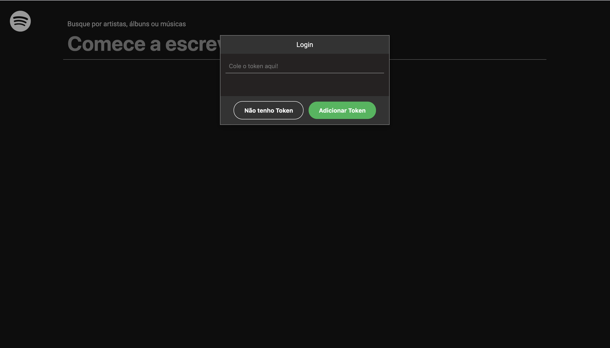
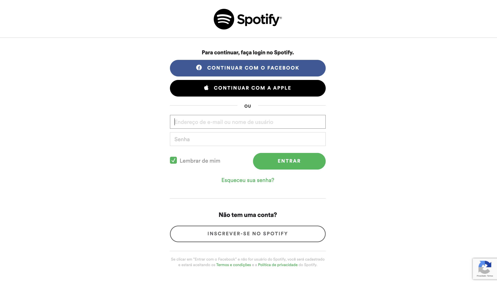
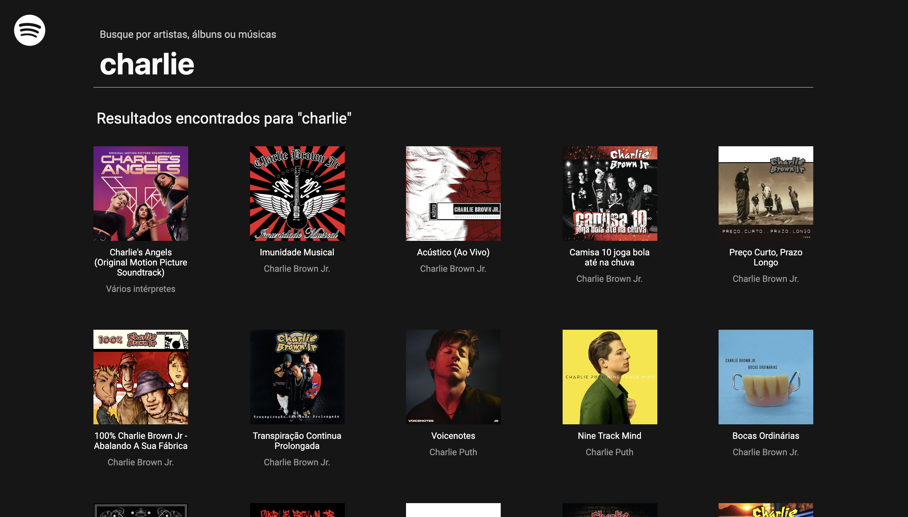
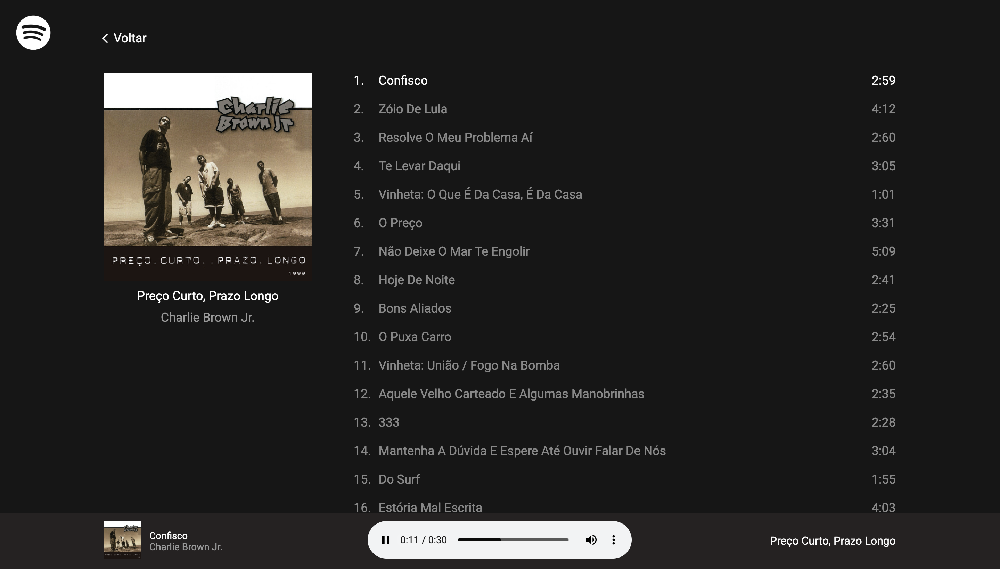
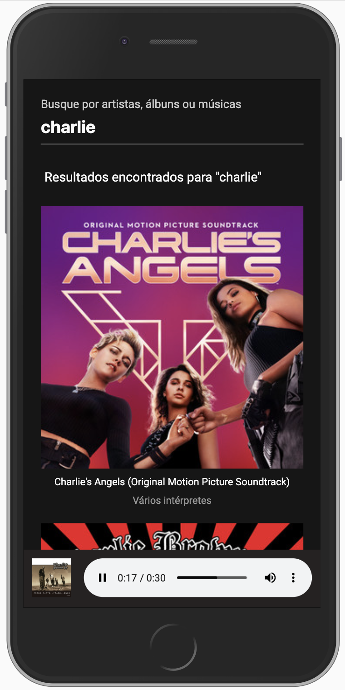
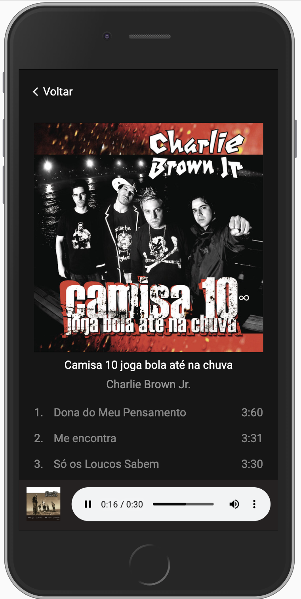
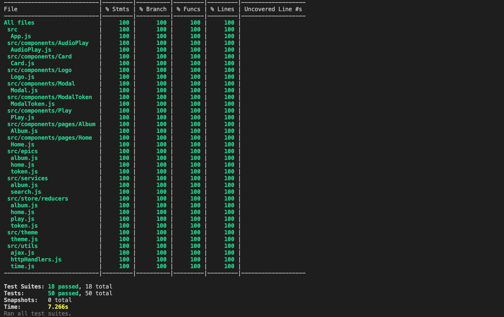

## Demonstração da aplicação

Caso queira ver a aplicação funcionando basta clicar no link abaixo:

[https://kelvearagao.github.io/spotify-app/](https://kelvearagao.github.io/spotify-app/)

A aplicação oferece duas alternativas para acessá-la:

1. Caso não tenha o token, basta clicar no botão "não tenho token", dessa forma você poderá fazer o login no spotify pelo facebook e ter a permição de acessar a aplicação;

2. Caso tenha o token basta colar campo "Colar token aqui" e clicar no botão "adicionar token".

Abaixo segue alguns prints da aplicação.
<br /><br />



Versão desktop:
<br /><br />


<br /><br />

Versão responsiva:
<br /><br />



### Principais tecnologias utilizadas

1. [ReactJs](https://pt-br.reactjs.org/)
2. [Redux](https://redux.js.org/)
3. [RxJs](https://www.learnrxjs.io/)
4. [Redux Observable](https://redux-observable.js.org/)
5. [React Router](https://reacttraining.com/react-router/web/guides/quick-start)
6. [Styled Components](https://styled-components.com/)
7. [Jest](https://jestjs.io/)
8. [Testing Library](https://testing-library.com/)
9. [Webpack](https://webpack.js.org/)
10. [Ramda](https://ramdajs.com/)

### Executar aplicação para desenvolvimento local

```
npm run start
```

### Executar testes com o watch ativado

```
npm run test
```

### Ver cobertura de testes

```
npm run test:ci
```

Cobertura de testes atual:
<br />
<br />


### Executar lint

```
npm run lint
```

### Formatar código em stage

```
npm run format
```

### Executar builds

```
npm run build:(dsv|hml|prd)
```

### Executar build dentro do docker

```
docker image build --build-arg APP_ENV=(dsv|hml|prd) -t spotify-app .
docker container run -p 3000:80 spotify-app
```
